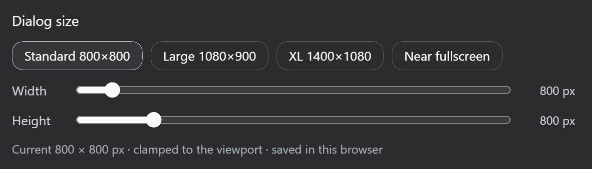

# dsh-settings-size

> **Give the DSH settings dialog a size you actually like.**
> A **设置弹框尺寸** row for the DeepSeek Harness (`dsh`) Web GUI — one-click presets, live width/height sliders, remembered locally.

[中文](README.md) · DSH plugin · MIT

---

## What it is

The DSH settings dialog is hardcoded to **800×800**, which feels cramped on a wide screen: after the 188px nav rail takes its share, the content column is left with roughly 612px. The size is not routed through any `--dsw-*` design token, so neither a theme nor the built-in appearance settings can reach it.

`dsh-settings-size` adds one row to **Settings → General** (right below 字体大小) with four presets and a pair of width/height sliders. Changes apply **live** — the dialog resizes while it is open — and the choice is written to `localStorage`, so it survives reloads.

- Shape: dual-face plugin (no-op host half + browser bundle)
- Applies to: the DSH Web GUI
- Persistence: `localStorage`, key `dsh-settings-size:size`
- No build step: `lib/*.js` is the shipped artifact



---

## Install

Add this repository to the `web` profile:

```sh
dsh plugin --profile web add -w <path-to-this-repo>
```

`-w` is required: every profile directory ships a `pnpm-workspace.yaml`, so pnpm treats the profile as a workspace root and a bare `add` fails with `ERR_PNPM_ADDING_TO_ROOT`.

The command links this package and appends `dsh-settings-size` to `dsh.profile.bundles`. A running web server has to be **restarted** to load the new bundle layer:

```sh
# stop the current instance, then
dsh web
```

After the restart, open **Settings → General** — the **设置弹框尺寸** row should be right below 字体大小.

<details>
<summary>Manual install (equivalent)</summary>

Edit `~/.dsh/profiles/web/package.json`:

```jsonc
{
  "dependencies": {
    "dsh-settings-size": "link:<path-to-this-repo>"
  },
  "dsh": {
    "profile": {
      "bundles": [ /* …existing entries…, */ "dsh-settings-size" ]
    }
  }
}
```

Then run `pnpm install` inside `~/.dsh/profiles/web` and restart `dsh web`.

</details>

---

## Uninstall

```sh
dsh plugin --profile web remove -w dsh-settings-size
```

Then restart `dsh web`. The plugin's `<style>` tag is owned by `ctx.effect` and is removed on unload; the `localStorage` key can be left alone or cleared by hand.

---

## Features

### Presets

| Preset | Target size | Notes |
|---|---|---|
| 标准 (Standard) | 800 × 800 | the shipped size |
| **大 (Large)** | **1080 × 900** | **default** |
| 超大 (XL) | 1400 × 1080 | |
| 近全屏 (Near-fullscreen) | 3000 × 2000 | deliberately oversized; `min()` clamps it to the viewport |

### Sliders

| Control | Range | Step |
|---|---|---|
| Width | 640 – 3000 px | 10 px |
| Height | 560 – 2000 px | 10 px |

The dialog resizes **as you drag** — no close-and-reopen.

### Also

- **Never overflows the viewport**: the rule reads `min(<target>px, calc(100vw - 32px))`, so a small screen or narrow window stays safe.
- **This browser only**: switching browsers, or clearing site data, returns to the default.

---

## Parameters and defaults

| Item | Value |
|---|---|
| Starting size (nothing stored yet) | 1080 × 900 |
| Width range / step | 640 – 3000 px / 10 px |
| Height range / step | 560 – 2000 px / 10 px |
| Viewport gutter | 32 px on each side |
| Storage key | `dsh-settings-size:size` |
| Storage format | `"<width>x<height>"`, e.g. `"1080x900"` |
| Row slot | `settings.general.item`, `id: settings-size`, `order: 15` |
| Injected services | `slots`, `locale` |
| Locale namespace | `settings.size` (zh / en, follows the active DSH language) |
| DSH compatibility | `^0.1.0` (the `@deepseek-ai/dsh` peer) |

---

## Compatibility and known limits

### Version compatibility

Manually verified against:

| DSH version | Result |
|---|---|
| `0.1.5-rc.2` | ✅ passes |
| `0.1.7-rc.2` | ✅ passes |

Versions not listed here are **expected to work as well**. The plugin depends on only a few stable
contracts — the `settings.general.item` slot, the `slots` and `locale` client services, and the settings
dialog's DOM structure — and reads no internal implementation or undocumented field, so a breaking upgrade
is unlikely. Compatibility results collected by third-party platforms (such as dsh.so) are worth checking too.

`package.json` declares `"@deepseek-ai/dsh": "^0.1.0"`, which DSH validates with `semver.satisfies()` at
startup and reports as an explicit version conflict when unsatisfied.

If it misbehaves on your version, or you have an improvement in mind, please
[open an issue](https://github.com/alexzshl/dsh-settings-size/issues) or send a PR — include the output of
`dsh --version` and what you saw.

### Known limits

- **It depends on the dialog's DOM structure** `role="presentation" > role="dialog"[aria-modal]`. If a future
  DSH release reshapes that layer, only the `PANEL` constant in `lib/client.js` needs updating — which is
  exactly why the hashed class name is not used.
- **Web GUI only.** The TUI and desktop profiles never load `dsh.client`, so the plugin has no effect there.
- **No shipped file is modified** — everything is done with overriding CSS and a slot registration.
- **A compatibility declaration can only live in `peerDependencies`**: `dsh-app-boot`'s
  `evaluatePluginCompatibility` scans only `package.json` peers named `@deepseek-ai/dsh` or starting with
  `@deepseek-ai/dsh-`, comparing them with `semver.satisfies(runtime, range, { includePrerelease: true })`
  and reporting the plugin name, version, and runtime version on a mismatch (with an exact-version exemption
  mechanism). A `dshCompatibility`-style field in `cordis.yml` / `cordis.patch.yml` is **never read** — that
  file is a patch array, so an extra key only makes the loader warn and skip the entry.
- Sizes are CSS pixels; browser zoom scales the result like any other DSH UI.

---

## Development

There is **no build step**: `lib/client.js` is a hand-written CJS bundle.

The web profile ships `dsh-client-hmr`, which polls every installed client bundle with `fs.watchFile`
and calls `clientModules.rebuilt(id)` as soon as one changes, then pushes the new module to the browser
over the `/plugins/events` SSE channel for a hot swap. **Saving the file is enough — no refresh and no
restart** (the poll adds a very short delay).

A restart of `dsh web` is only needed for changes to the host half (`lib/index.js`), `cordis.patch.yml`,
`package.json`, or the profile composition. For local work, a `link:` install is the easiest path:

```sh
dsh plugin --profile web add -w <path-to-this-repo>
```

---

## Further reading (optional)

<details>
<summary><b>Why it is needed</b> — the two shipped size layers</summary>

### Layer 1 — the panel size is hardcoded

From `SettingsRoot.module.css` in `@deepseek-ai/dsh-client-ui-settings-general`:

```css
.VOzbGW_panel {
  width: 800px;
  max-width: calc(100vw - 48px);
  height: min(800px, 100vh - 48px);
}
.VOzbGW_nav { width: 188px; }   /* fixed nav rail */
```

### Layer 2 — every section caps its own content column

Widening the panel alone **does not help**: each section still clamps its content column, so the extra width stays empty:

| Section | Content cap |
|---|---|
| `.zGbnIq_section` (models) | `max-width:720px` |
| `.rtSEdW_section` (agent presets) | `max-width:720px` |
| `.pbvGtq_section` (plugins) | `max-width:760px` |
| `.qSYn7G_section` (plugin inventory) | `max-width:760px` |

This plugin overrides **both layers**.

</details>

<details>
<summary><b>How it works</b> — dual-face shape, selector strategy, persistence boundary</summary>

### Dual-face shape

The same shape as the shipped `ui-*` packages:

- **Host half** (`lib/index.js`) — a `dsh.bundle` patch layer inserting one loader entry (`settings-size`); a no-op `apply`.
- **Browser half** (`lib/client.js`) — a `dsh.client` bundle served by `dsh-client-modules` at
  `/plugins/dsh-settings-size/client.js`, executed through `window.__ModuleLoader__.load`'s CJS factory, with
  `require()` resolving `react` against the shell's module table. It keeps one owned `<style>` tag in sync,
  registers its zh/en dictionaries under the `settings.size` locale namespace, and registers the row into
  `settings.general.item` with `locale`, so the owner injects a namespace-bound `t` and re-renders on a
  language switch.

### Selector strategy

The override targets the DOM **structurally**, never through the CSS-module class name (whose hash changes with the file):

```css
div[role="presentation"] > div[role="dialog"][aria-modal="true"] {
  width: min(<w>px, calc(100vw - 32px)) !important;
  height: min(<h>px, calc(100vh - 32px)) !important;
  max-width: calc(100vw - 32px) !important;
}
div[role="presentation"] > div[role="dialog"][aria-modal="true"] [class*="_section"] {
  max-width: none !important;
}
```

Two things worth noting:

- **It cannot hit the wrong dialog.** The attachment lightbox is also `role="dialog"` + `aria-modal="true"`,
  but it is a portal root — not a direct child of a `role="presentation"` container — so this combination
  matches only the settings panel.
- **Specificity already wins.** The selector scores `0,2,3` against the shipped `.VOzbGW_panel` at `0,1,0`.
  The `!important` flags are there to survive future shipped edits, not because they are needed today.

### Why localStorage instead of Host settings

DSH's Host settings wire only exposes an allowlisted set of namespaces to browser clients
(`WEB_SETTINGS_NAMESPACES`, see `dsh-host-apiproxy`), so a third-party namespace would answer
`settings-not-exposed`. A dialog size is a **browser-side visual preference**; `localStorage` matches the
boundary the product already keeps for remote browser preferences while still surviving a same-origin reload.

### Repository layout

```
dsh-settings-size/
├── package.json         # dsh.bundle.patch + dsh.client declarations
├── cordis.patch.yml     # profile patch layer: loader entry id=settings-size
├── lib/
│   ├── index.js         # host half: no-op apply
│   └── client.js        # browser half: CSS override + settings row + i18n + persistence
├── docs/
│   ├── screenshot-zh.png
│   └── screenshot-en.png
└── README.md / README.en.md
```

</details>

<details>
<summary><b>Two traps for plugin authors</b> — silent failures caused by variable shadowing</summary>

Both hit this plugin as **silent failures**, and both are variable shadowing. Written down so the next author does not pay for them:

1. **Never name your stylesheet `styles` in a dynamic Cordis plugin.**
   Dynamic client code is evaluated by `new Function("React", "console", "styles", "host", "harness", …)`, so
   `const styles = {…}` shadows the injected `styles.insert` and every stylesheet insertion throws
   `styles.insert is not a function` — and if it sits inside a `try/catch`, nothing ever surfaces.
2. **Never let a module-level updater share a name with a component's state setter.**
   `const [size, setSize] = React.useState(current)` shadows a module-level `setSize(w, h)`. React's setter
   takes a single argument, so `setSize(1080, 900)` stores the number `1080` — the UI then reads
   `undefined × undefined` and the setting does nothing at all.

The common shape: **an inner scope declares a binding with the same name as an outer one but different
semantics, and the failure is silent.** When debugging that class of problem, get runtime facts first
(a DOM probe, the computed style) instead of guessing at selectors.

</details>

---

## License

MIT
