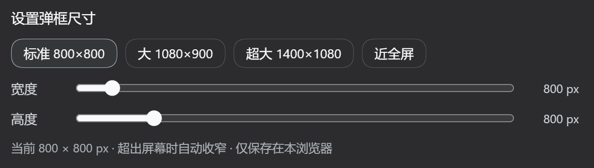

# dsh-settings-size

> **把 DSH 的设置弹框调到舒服的大小。**
> 为 DeepSeek Harness（`dsh`）Web GUI 加一行「设置弹框尺寸」——预设一键切换，滑块实时微调，选择保存在本地。

[English](README.en.md) · [更新日志](CHANGELOG.md) · DSH 插件 · MIT

[](https://www.dsh.so/artifact/dsh-settings-size/)
[](https://www.dsh.so/artifact/dsh-settings-size/)
[](https://dsh-plugin.org/plugins/alexzshl/dsh-settings-size)

---

## 简介

DSH 的设置弹框是**硬编码 800×800** 的，在宽屏上显得局促：左侧 188px 导航栏吃掉一块之后，右侧内容列只剩约 612px。它没有走 `--dsw-*` 设计 token，所以无论换皮肤还是调外观设置都碰不到它。

`dsh-settings-size` 在 **设置 → 通用** 里加一行控件（就在「字体大小」下面），提供四档预设和宽高双滑块，**改动实时生效**，弹框开着就能看到变化；选择写入 `localStorage`，刷新后保留。

- 插件类型：双面包（host no-op + browser bundle）
- 生效范围：DSH Web GUI
- 持久化：`localStorage`，键 `dsh-settings-size:size`
- 无构建步骤：`lib/*.js` 就是最终产物



---

## 安装

把本仓库加入 `web` profile：

```sh
dsh plugin --profile web add -w <本仓库路径>
```

`-w` 是必需的：每个 profile 目录都带 `pnpm-workspace.yaml`，pnpm 会把 profile 当作 workspace 根，
裸 `add` 会报 `ERR_PNPM_ADDING_TO_ROOT`。

该命令会链接本包并把 `dsh-settings-size` 追加进 `dsh.profile.bundles`。运行中的 web 服务器需要**重启**才会加载新的 bundle 层：

```sh
# 停掉当前实例，然后
dsh web
```

重启后打开 **设置 → 通用**，在「字体大小」下方应能看到 **设置弹框尺寸** 一行。

<details>
<summary>手动安装（等价写法）</summary>

编辑 `~/.dsh/profiles/web/package.json`：

```jsonc
{
  "dependencies": {
    "dsh-settings-size": "link:<本仓库路径>"
  },
  "dsh": {
    "profile": {
      "bundles": [ /* …原有条目…, */ "dsh-settings-size" ]
    }
  }
}
```

然后在 `~/.dsh/profiles/web` 下执行 `pnpm install`，再重启 `dsh web`。

</details>

---

## 卸载

```sh
dsh plugin --profile web remove -w dsh-settings-size
```

随后重启 `dsh web`。插件的 `<style>` 标签由 `ctx.effect` 持有，卸载时会自动移除；
`localStorage` 里的键可以留也可以手动清掉。

---

## 功能

### 预设

| 预设 | 目标尺寸 | 说明 |
|---|---|---|
| 标准 | 800 × 800 | shipped 原样 |
| **大** | **1080 × 900** | **默认值** |
| 超大 | 1400 × 1080 | |
| 近全屏 | 3000 × 2000 | 故意超出屏幕，由 `min()` 夹到视口 |

### 滑块

| 项目 | 范围 | 步进 |
|---|---|---|
| 宽度 | 640 – 3000 px | 10 px |
| 高度 | 560 – 2000 px | 10 px |

拖动过程中弹框**即时改变**，不需要关闭重开。

### 其他

- **超出视口自动收窄**：规则写作 `min(<目标>px, calc(100vw - 32px))`，小屏或窄窗口下不会溢出屏幕。
- **仅保存在本浏览器**：换浏览器或清空站点数据会回到默认值。

---

## 参数与默认值

| 项目 | 值 |
|---|---|
| 首次使用尺寸（本机未设置过时） | 1080 × 900 |
| 宽度范围 / 步进 | 640 – 3000 px / 10 px |
| 高度范围 / 步进 | 560 – 2000 px / 10 px |
| 视口留边 | 四边各 32 px |
| 存储键 | `dsh-settings-size:size` |
| 存储格式 | `"<宽度>x<高度>"`，例如 `"1080x900"` |
| 设置行位置 | `settings.general.item`，`id: settings-size`，`order: 15` |
| 依赖服务 | `slots`、`locale` |
| 语言命名空间 | `settings.size`（zh / en，跟随 DSH 语言自动切换） |
| DSH 兼容范围 | `^0.1.0`（`peerDependencies` 里的 `@deepseek-ai/dsh`） |

---

## 兼容性与已知限制

### 版本兼容性

本插件在以下 DSH 版本上**手动验证通过**：

| DSH 版本 | 结果 |
|---|---|
| `0.1.5-rc.2` | ✅ 通过 |
| `0.1.7-rc.2` | ✅ 通过 |

未列出的版本**预期同样可用**。插件只依赖少数稳定契约——`settings.general.item` 槽位、`slots` 与 `locale`
两个客户端服务、以及设置弹框的 DOM 结构——不读取任何内部实现或未公开字段，因此升级带来破坏性变更的
概率很低。第三方平台整理的兼容性结果（如 [dsh.so](https://www.dsh.so/artifact/dsh-settings-size/)）也值得一并参考。

插件在 `package.json` 中声明了 `"@deepseek-ai/dsh": "^0.1.0"`，DSH 启动时会用 `semver.satisfies()`
自动校验，不满足时给出明确的版本冲突告警。

如果你在某个版本上遇到问题，或者有改进建议，欢迎[提交 Issue](https://github.com/alexzshl/dsh-settings-size/issues)
或直接发起 PR；报告时请附上 `dsh --version` 的输出与具体现象。

### 已知限制

- **依赖弹框的 DOM 结构** `role="presentation" > role="dialog"[aria-modal]`。若未来 DSH 改版换了这层结构，
  只需要改 `lib/client.js` 里的 `PANEL` 常量，其余逻辑不受影响——这也是不用哈希类名的原因。
- **只影响 Web GUI**。TUI / desktop profile 不加载 `dsh.client`，插件对它无副作用。
- **不修改任何 shipped 文件**：全部通过覆盖式 CSS 与槽位注册实现。
- **版本兼容声明只能写在 `peerDependencies`**：`dsh-app-boot` 的 `evaluatePluginCompatibility`
  只扫描 `package.json` 里 `@deepseek-ai/dsh` 与 `@deepseek-ai/dsh-*` 开头的 peer，用
  `semver.satisfies(runtime, range, { includePrerelease: true })` 比对，不满足时给出插件名、版本与
  运行版本的告警（另有 exact-version 豁免机制）。`cordis.yml` / `cordis.patch.yml` 里的
  `dshCompatibility` 之类字段**不会被读取**——那个文件是 patch 数组，多塞一个键只会让 loader 告警并跳过。
- 尺寸以 CSS 像素计，浏览器缩放会等比影响观感（与 DSH 其他 UI 一致）。

---

## 开发

本仓库**没有构建步骤**：`lib/client.js` 就是手写的 CJS bundle。

web profile 带有 `dsh-client-hmr`，它用 `fs.watchFile` 轮询每个已安装的客户端 bundle，
文件一变就调用 `clientModules.rebuilt(id)` 重新读取并合成，再通过 `/plugins/events` SSE
把新模块推给浏览器热替换。所以**改完保存即生效，既不需要刷新也不需要重启**（轮询有极短的延迟）。

只有当改动落在 host 半（`lib/index.js`）、`cordis.patch.yml`、`package.json`
或 profile 组合时，才需要重启 `dsh web`。本地开发用 `link:` 安装最方便：

```sh
dsh plugin --profile web add -w <本仓库路径>
```

---

## 深入阅读（可选）

<details>
<summary><b>为什么需要它</b> —— shipped 的两层尺寸限制</summary>

### 一层：面板尺寸写死

`@deepseek-ai/dsh-client-ui-settings-general` 的 `SettingsRoot.module.css`：

```css
.VOzbGW_panel {
  width: 800px;
  max-width: calc(100vw - 48px);
  height: min(800px, 100vh - 48px);
}
.VOzbGW_nav { width: 188px; }   /* 左侧导航固定宽 */
```

### 二层：各分区内容列另有上限

只把面板改宽**没有用**——每个分区自己还卡着内容列宽度，多出来的空间会是一片空白：

| 分区 | 内容列上限 |
|---|---|
| `.zGbnIq_section`（模型） | `max-width:720px` |
| `.rtSEdW_section`（Agent 预设） | `max-width:720px` |
| `.pbvGtq_section`（插件） | `max-width:760px` |
| `.qSYn7G_section`（插件清单） | `max-width:760px` |

本插件**同时覆盖这两层**。

</details>

<details>
<summary><b>工作原理</b> —— 双面包结构、选择器策略、持久化边界</summary>

### 双面包结构

和 shipped 的 `ui-*` 包同构：

- **Host 半**（`lib/index.js`）—— 一个 `dsh.bundle` patch 层，插入一条 loader 条目（`settings-size`）；`apply` 是空实现。
- **Browser 半**（`lib/client.js`）—— 一个 `dsh.client` bundle，由 `dsh-client-modules` 在
  `/plugins/dsh-settings-size/client.js` 提供，通过 `window.__ModuleLoader__.load` 的 CJS 工厂执行，
  `require()` 解析 shell 模块表里的 `react`。它维护一个自有 `<style>` 标签，把中英字典注册进
  `settings.size` 语言命名空间，并向 `settings.general.item` 注册那一行（注册时带 `locale`，
  由 owner 注入命名空间绑定的 `t`，并在语言切换时重渲染）。

### 选择器策略

覆盖规则**走 DOM 结构**，不用 CSS Module 的哈希类名（那个哈希会随文件内容变化）：

```css
div[role="presentation"] > div[role="dialog"][aria-modal="true"] {
  width: min(<w>px, calc(100vw - 32px)) !important;
  height: min(<h>px, calc(100vh - 32px)) !important;
  max-width: calc(100vw - 32px) !important;
}
div[role="presentation"] > div[role="dialog"][aria-modal="true"] [class*="_section"] {
  max-width: none !important;
}
```

两点考量：

- **不会误伤别的弹窗**。附件灯箱也是 `role="dialog"` + `aria-modal="true"`，但它是 portal 根节点，
  不是 `role="presentation"` 容器的直接子元素，因此这个组合只会命中设置面板。
- **权重足够**。该选择器权重 `0,2,3`，高于 shipped 的 `.VOzbGW_panel`（`0,1,0`）；
  `!important` 是为了抵御未来 shipped 样式变化，并非当前必需。

### 为什么用 localStorage 而不是 Host settings

DSH 的 Host settings 通道只向浏览器暴露一个 allowlist（`WEB_SETTINGS_NAMESPACES`，见 `dsh-host-apiproxy`），
第三方命名空间会得到 `settings-not-exposed`。弹框尺寸属于**浏览器侧的视觉偏好**，用 `localStorage`
既符合产品自身对远程浏览器偏好的边界，又能在同源刷新后保留。

### 项目结构

```
dsh-settings-size/
├── package.json         # dsh.bundle.patch + dsh.client 声明
├── cordis.patch.yml     # profile patch 层：插入 loader 条目 id=settings-size
├── lib/
│   ├── index.js         # host 半：no-op apply
│   └── client.js        # browser 半：CSS 覆盖 + 设置行 + 本地化 + 持久化
├── docs/
│   ├── screenshot-zh.png
│   └── screenshot-en.png
└── README.md / README.en.md
```

</details>

<details>
<summary><b>给插件作者的两条坑</b> —— 变量遮蔽导致的静默失败</summary>

写这个插件时踩到的两个**静默失败**，都是变量遮蔽，记在这里省得别人再花时间：

1. **动态 Cordis 插件里不要把自己的样式表命名成 `styles`。**
   动态客户端代码由 `new Function("React", "console", "styles", "host", "harness", …)` 求值，
   `const styles = {…}` 会遮蔽注入的 `styles.insert`，于是每次插入样式表都抛
   `styles.insert is not a function`——如果外面套了 `try/catch`，它连报错都不会浮上来。
2. **模块级状态更新函数不要和组件内的 state setter 重名。**
   `const [size, setSize] = React.useState(current)` 会遮住模块级的 `setSize(w, h)`；
   而 React 的 setState 只接受一个参数，`setSize(1080, 900)` 会把状态存成数字 `1080`，
   表现为界面显示 `undefined × undefined` 且设置完全无效。

共同点是：**内层作用域声明了与外层同名但语义不同的绑定，且失败是静默的。**
调试这类问题时，先拿运行态数据（DOM 探针 / 实际计算样式），不要凭猜测改选择器。

</details>

---

## License

MIT
